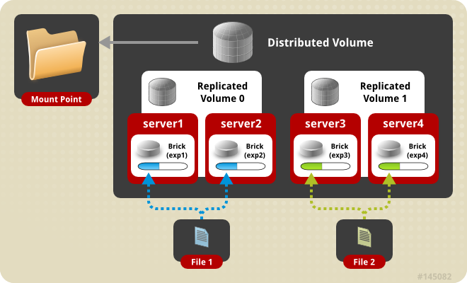

# GlusterFS
---
## 什么是GlusterFS？
GlusterFS是一个开源的分布式的文件系统, 可以容易的扩展PB级别, 且可以处理数千级别的客户端. GlusterFS以模块化, 可堆叠以及没有元数据信息的分
布式文件系统. 没有服务器端元数据的架构拥有更高端性能, 扩展性和可靠性.GlusterFS可灵活组合商品的物理，虚拟和云资源提供高可用性和高性能的解决方案，在传统的成本的一小部分企业存储。

这些服务器由以太网或无限带宽技术Infiniband以及远程直接内存访问RDMA互相融汇，最终所形成的一个大的并行文件系统网络。它有包括云计算在内的多重应用，诸如：生物医药科学，文档存储。Gluster是由GNU托管的自由软件，证书是AGPL。Gluster公司是Gluster的首要商业赞助商，且提供商业产品以及基于Gluster的解决方案.

### 设计
ClusterFS是C/S架构, 服务器上部署了brick上, 每一台服务器运行着名为glusterfs的守
护进程, 将本地文件系统作为卷进行输出. Gluster客户端进程通过TCP/IP, InfiniBand或
者SDP一类客户协议连接到服务器. 将远端组成一个大的所谓的折叠翻译器, 最终通过FUSE的用户空间文件机制挂载到客户机.

## 术语
### ACL
Access Control Lists

### brick
存储的基本单元, 受信任存储池里展示的基本单位以目录显示存在.

### Cluster
### Distributed File System
### FUSE
文件系统在用户空间（fuse）是一个Unix系统，允许非特权用户创建他们自己的文件系统没有编辑内核可加载内核模块。这是通过在用户空间中运行文件系统代码而实现的，而融合模块只提供一个“桥梁”的实际内核接口。

### glusterd
在gluster服务端的管理进程, 运行在所有的server上

### Geo-Replication
Geo-Replication提供一个不间断, 异步和增量的复制服务, 利用LAN,WAN或者内网从一台server复制到其他的server上.

### Metadata
定义了存储数据的信息, glusterfs不会实现自定义的metadata存储空间,而是存储在文件本身.

### Namespace
命名空间是一个抽象的容器或环境，创建一个唯一的标识符或符号的逻辑分组.
每gluster volume 暴露一个命名空间作为POSIX挂载点,其包含在集群中的每一个文件。

### posix
### raid
### rrdns
域名轮转服务,
### Trusted Storage Pool
### Userspace
### Volume
卷是存储目录的逻辑组合。大部分gluster 管理操作是在卷上进行的。 brick的集合.
### vol file

### client
### server
### replicate
### 

## quick start
gluster使用3.8的,centos 6, 两台主机192.168.80.215/6
在两台机器上都执行如下语句.

安装前准备:
1. hostname,规划域名解析
2. ntp
3. ​

- 1.添加磁盘,并格式化, 并加入挂载. 可以直接使用磁盘, 或者是用lvm格式, 可以动态添加.
```bash
fdisk -l
mkfs -L brick1 -i size=512 /dev/sdc 
mkfs.xfs  -L brick1 -i size=512 /dev/sdc 
mkdir -p /data/brick1 -v
echo "/dev/sdc /data/brick1 xfs defaults 1 2" >> /etc/fstab 

mount -a && mount
```
- 2.在CentOS 6上配置yum 源, 并安装启动.
```bash
cat >>/etc/yum.repos.d/gluster.repo<<EOF
[glusterfs-epel]
name=GlusterFS is a clustered file-system capable of scaling to several petabytes.
baseurl=  http://buildlogs.centos.org/centos/\$releasever/storage/\$basearch/gluster-3.8/
enabled=1
skip_if_unavailable=1
gpgcheck=0

[glusterfs-noarch-epel]
name=GlusterFS is a clustered file-system capable of scaling to several petabytes.
baseurl=  http://buildlogs.centos.org/centos/\$releasever/storage/\$basearch/gluster-3.8/
enabled=1
skip_if_unavailable=1
gpgcheck=0
EOF

yum install glusterfs-server -y
service glusterd start
service glusterd statu
```

- 1. 配置可信任的关系.
     在server1 215上
```
gluseter peer probe 192.168.80.216
```
在server2 216上
```
gluster peer probe 192.168.80.215
```

- 4.建立volume
  在server1 和 server2上建立目录
```
mkdir  /data/brick1/gv0
```

在单台server1上, server1或者server2建立volume
```
gluster volume create gv0 replica 2 192.168.80.215:/data/brick1/gv0 192.168.80.216:/data/brick1/gv0

gluster volume start gv0
```

确认以及显示volume信息
```
shell> gluster volume info
Volume Name: gv0
Type: Replicate
Volume ID: 8b42fc18-4f35-4bcc-9c8f-1efda433cc4f
Status: Started
Snapshot Count: 0
Number of Bricks: 1 x 2 = 2
Transport-type: tcp
Bricks:
Brick1: 192.168.80.215:/data/brick1/gv0
Brick2: 192.168.80.216:/data/brick1/gv0
Options Reconfigured:
transport.address-family: inet
performance.readdir-ahead: on
nfs.disable: on

```

- 5.客户端挂载并添加测试文件

```
mount  -t glusterfs 192.168.80.215:/gv0 /mnt
for i in `seq -w 1 100` ;do cp -rp /var/log/messages /mnt/copy-test-$; done

```

查看客户端挂载点
```
ls　-lA /mnt 
```

查看server端 server1和server2

```
 ls -lA /data/brick1/gv0
```

## 常见操作

1、添加资源池服务器
```
#gluster peer probe NODE_NAME
```
删除资源池
```
gluster volume stop  VOLUME_NAME
gluster volume delete VOLUME_NAME
gluster peer detach node3  VOLUME_NAME
```
2、添加brick
```
gluster volume add-brick VOLUME_NAMENODE_NAME:BRICK_DIR  [NODE_NAME:BRICK_DIR]
gluster volume remove-brick VOLUME_NAME  NODE_NAME:BRICK_DIR  [NODE_NAME:BRICK_DIR ]
```
3、rebalance卷
当扩展或者收缩一个卷（add-brick/remove-brick）以后，需要rebalance数据
```
gluster volume rebalance VOLUME_NAME start
gluster volume rebalance VOLUME_NAME status
gluster volume rebalance VOLUME_NAME stop
```


### 系统配额：
- 1、开启/关闭系统配额
`gluster volume quota VOLNAME enable/disable`

- 2、设置(重置)目录配额
```
gluster volume quota VOLNAME limit-usage /img limit-value
gluster volume quota img limit-usage /quota 10GB
```
设置img 卷下的quota 子目录的限额为10GB。这个目录是以系统挂载目录为根目录”/”，所以/quota 即客户端挂载目录下的子目录quota
- 3、配额查看
```
gluster volume quota VOLNAME list
gluster volume quota VOLNAME list
```
可以使用如上两个命令进行系统卷的配额查看，第一个命令查看目的卷的所有配额设置，
第二个命令则是执行目录进行查看。可以显示配额大小及当前使用容量，若无使用容量(最小0KB)则说明设置的目录可能是错误的(不存在)。

### 地域复制：
```
gluster volume geo-replication MASTER SLAVE start/status/stop
 //地域复制是系统提供的灾备功能，能够将系统的全部数据进行异步的增量备份到另外的磁盘中。
```
`gluster volume geo-replication img 192.168.10.8:/data1/brick1 start`
如上，开始执行将img 卷的所有内容备份到10.8 下的/data1/brick1 中的task，需要注意的是，这个备份目标不能是系统中的Brick。

### 平衡卷：
平衡布局是很有必要的，因为布局结构是静态的，当新的bricks 加入现有卷，新创建的文件会分布到旧的bricks 中，所以需要平衡布局结构，使新加入的bricks 生效。布局平衡只是使
新布局生效，并不会在新的布局移动老的数据，如果你想在新布局生效后，重新平衡卷中的数据，还需要对卷中的数据进行平衡。
当你扩展或者缩小卷之后，需要重新在服务器直接重新平衡一下数据，重新平衡的操作被分

#### 为两个步骤：
- 1、Fix Layout
修改扩展或者缩小后的布局，以确保文件可以存储到新增加的节点中。
- 2、Migrate Data
重新平衡数据在新加入bricks 节点之后。
* Fix Layout and Migrate Data

先重新修改布局然后移动现有的数据(重新平衡)
```
# gluster volume rebalance VOLNAME fix-layout start
# gluster volume rebalance VOLNAME migrate-data start
```
也可以两步合一步同时操作
```
# gluster volume rebalance VOLNAME start
# gluster volume rebalance VOLNAME status //你可以在在平衡过程中查看平衡信息
#  gluster volume rebalance VOLNAME stop //
你也可以暂停平衡，再次启动平衡的时候会从上次暂停的地方继续开始平衡。
```
**I/O 信息查看：**
Profile Command 提供接口查看一个卷中的每一个brick 的IO 信息
```
#gluster volume profile VOLNAME start //启动profiling，之后则可以进行IO 信息查看
#gluster volume profile VOLNAME info //查看IO 信息，可以查看到每一个Brick 的IO 信息
#gluster volume profile VOLNAME stop //查看结束之后关闭profiling 功能
```
**Top监控：**
Top command 允许你查看bricks 的性能例如：read, write, fileopen calls, file read calls, file,write calls,directory open calls, and directory real calls
所有的查看都可以设置top 数，默认100
```
# gluster volume top VOLNAME open [brick BRICK-NAME] [list-cnt cnt] //查看打开的fd
# gluster volume top VOLNAME read [brick BRICK-NAME] [list-cnt cnt] //查看调用次数最多的读调用
# gluster volume top VOLNAME write [brick BRICK-NAME] [list-cnt cnt] //查看调用次数最多的写调用
# gluster volume top VOLNAME opendir [brick BRICK-NAME] [list-cnt cnt] //查看次数最多的目录调用
# gluster volume top VOLNAME readdir [brick BRICK-NAME] [list-cnt cnt] //查看次数最多的目录调用
# gluster volume top VOLNAME read-perf [bs blk-size count count] [brickBRICK-NAME] [list-cnt cnt] //查看每个Brick 的读性能
# gluster volume top VOLNAME write-perf [bs blk-size count count] [brickBRICK-NAME] [list-cnt cnt] //查看每个Brick 的写性能
```
**性能优化配置选项：**
```
gluster volume set arch-img cluster.min-free-disk 默认是10% 磁盘剩余告警
gluster volume set arch-img cluster.min-free-inodes 默认是5% inodes 剩余告警
gluster volume set img performance.read-ahead-page-count 8 默认4，预读取的数量
gluster volume set img performance.io-thread-count 16 默认16 io 操作的最大线程
gluster volume set arch-img network.ping-timeout 10 默认42s
gluster volume set arch-img performance.cache-size 2GB 默认128M 或32MB，
gluster volume set arch-img cluster.self-heal-daemon on 开启目录索引的自动愈合进程
gluster volume set arch-img cluster.heal-timeout 300 自动愈合的检测间隔，默认为600s #3.4.2版本才有
gluster volume set arch-img performance.write-behind-window-size 256MB #默认是1M 能提高写性能单个文件后写缓冲区的大小默认1M
```


## glusterfs常见的建构


### gluster支持的volume种类
Glusterfs支持七种Volume，即Distribute卷、Stripe卷、Replica卷、Distribute stripe卷和Distribute replica卷，Distribute Stripe， Replica Volume卷这七种卷可以满足不同应用对高性能、高可用的需求。

#### 基本卷
1. distribute volume: 分布式卷, 基于DHT 存储的
2. stripe volume: 条带卷
3. replica volume: 复制卷

#### 复合卷
1. distribute stripevolume: 分布式条带卷
2. distribute replica volume: 分布式复制卷
3. stripe replica volume: 条带复制卷
4. distribute stripe replica volume: 分布式条带复制卷

#### distribute volume: 分布式卷
架构如下图

文件通过hash算法分不到所有brick server上, 这种卷是glusterfs的基础和最大特点;实只是扩大磁盘空间, 如果一个磁盘坏了, 对应的数据也会丢失,  不具有容错能力.

创建分布式卷
`gluster volume create NEW-VOLNAME  [transport [tcp | rdma | tcp,rdma]] NEW-BRICK`

```bash
gluster volume create test-volume server1:/exp1 server:/exp2 server3:/exp3 server4:/exp4

gluster volume info
Volume Name: test-volume
Type: Distribute
Status: Created
Number of Bricks: 4
Transport-type: tcp
Bricks:
Brick1: server1:/exp1
Brick2: server2:/exp2
Brick3: server3:/exp3
Brick4: server4:/exp4
```
#### replica volume

功能：
将文件存放在服务器里，如上图，File1同时存在server1和server2，File2也是如此，相当于server2中的文件是server1中文件的副本。

Replicated模式，也称作AFR（AutoFile Replication），相当于raid1，即同一文件在多个镜像存储节点上保存多份，每个replicated子节点有着相同的目录结构和文件。replicated模式一般不会单独使用，经常是以“Distribute+ Replicated”或“Stripe+ Replicated”的形式出现的。如果两台机的存储容量不同，那么就如木桶效应，系统的存储容量由容量小的机器决定。replica数必须等于volume中brick所包含的存储服务器数，可用性高。创建一个两两互为备份的卷，存储池中一块硬盘损坏，不会影响到数据的使用，最少需要两台服务器才能创建分布镜像卷。

Replicated模式是在文件的级别上进行的（相比较于HDFS），而且在创建卷volume时就确定每个server节点的职责，而且只能人工的进行调整。这样的话就相对的不灵活，如果一个节点A出了问题，就一定要用新的节点去替代A，否则就会出现一些问题隐患。

在Replicated模式下，每个文件会有如下几个扩展属性：
**读写数据时，具体的情况如下**：
**读数据时**：系统会将请求均衡负载到所有的镜像存储节点上，在文件被访问时同时就会触发self-heal机制，这时系统会检测副本的一致性（包括目录、文件内容、文件属性等）。若不一致则会通过changelog找到正确版本，进而修复文件或目录属性，以保证一致性。

**写数据时**：以第一台服务器作为锁服务器，先锁定目录或文件，写changelog记录该事件，再在每个镜像节点上写入数据，确保一致性后，擦除changelog记录，解开锁。

如果互为镜像的多个节点中有一个镜像节点出现了问题，用户的读/写请求都可以正常的进行，并不会受到影响。而问题节点被替换后，系统会自动在后台进行同步数据来保证副本的一致性。但是系统并不会自动地需找另一个节点来替代它，而是需要通过人工新增节点来进行，所以管理员必须及时地去发现这些问题，不然可靠性就很难保证。
##### 复制卷的创建语法
`gluster volume create NEW-VOLUME [replocat COUNT] [transport [tcp| rdma|tcp, rdma]] NEW-BRICK ...`

```
gluster volume create test-volume replica 2 transport tcp server1:/exp1 server2:/exp2

```

#### 分布式复制卷
分布式的复制卷，volume中brick所包含的存储服务器数必须是 replica 的倍数(>=2倍)，兼顾分布式和复制式的功能。


功能：
将文件备份随机存放在服务器里，如上图，server1(exp1)存放File1文件，Server1(exp2)存放File2文件。server2(exp3)存放File1的备份文件，server2(exp4)存放File2的备份文件。

创建语法
```
gluster volume create NEW-VOLUME [replica COUNT] [transport [tcp|rdma|tcp, rdma]] NEW-BRICK ...
```

```
gluster volume create test-volume replica 2 transport tcp server1:/exp1 server2:/exp2 server3:/exp3 server4:/exp4
```

#### 条带卷

功能：
将文件存放在不同服务器里，如上图，File被分割为6段，1、3、5放在server1，2、4、6放在server2

其实Stripe模式相当于raid0，在该模式下，系统只是简单地根据偏移量将文件分成N块（N个stripe节点时），然后发送到每个server节点。server节点把每一块都作为普通文件存入本地文件系统中，并用扩展属性记录了总的块数（stripe-count）和每一块的序号（stripe-index）。stripe数必须等于volume中brick所包含的存储服务器数，文件被分成数据块，以Round Robin的方式存储在bricks中，并发粒度是数据块，大文件性能好.

创建语法:
```
gluster volume create VOLUME_NAME [stripe COUNT] [transport [tcp|rdma|tcp,rdma]] NEW-BRICK ... 
```

```
gluster volume create test-volume stripe 2 transport  tcp server1:/exp1 server2:/epx2
```

### 分布式条带卷
分布式的条带卷，volume中brick所包含的存储服务器数必须是stripe的倍数(>=2倍)，兼顾分布式和条带式的功能。每个文件分布在四台共享服务器上，通常用于大文件访问处理，最少需要 4 台服务器才能创建分布条带卷。


将文件存到不同服务器里，如上图，File被分割成4段，1、3在server1(exp1)中，2、4在server1(exp2)中。server2(exp3)1、3存放server1(exp1)中的备份文件，server2(exp4)2、4存放server1(exp2)中的备份文件。

创建语法
```
gluster volume create NEW-VOLNAME [stripe COUNT] [transport [tcp | rdma | tcp,rdma]] NEW-BRICK...
```

```
gluster volume create test-volume stripe 2 transport tcp server1:/exp1 server2:/exp2 server3:/exp3 server4:/exp4 server5:/exp5 server6:/exp6 server7:/exp7 server8:/exp8 
```

## 词汇表
