# 如何测试云硬盘

## 测试前提
测试时, 分清楚:
- 测试对象: 区分硬盘, ssd, RAID, SAN,云硬盘等. 因为他们有不同的特点
- 测试指标: IOPS和MBPS(吞吐率)
- 测试工具: Linux:fio, dd; windows:IOMeter
- 测试参数: IO大小,寻址空间, 队列深度, 读写模式, 随机/顺序模式
- 测试方法: 测试步骤


## 存储系统模型

为了更好的测试，我们需要先了解存储系统，块存储系统本质是一个排队模型，我们可以拿银行作为比喻。还记得你去银行办事时的流程吗？

1. 去前台取单号
2. 等待排在你之前的人办完业务
3. 轮到你去某个柜台
4. 柜台职员帮你办完手续1
5. 柜台职员帮你办完手续2
6. 柜台职员帮你办完手续3
7. 办完业务，从柜台离开


如何评估银行的效率呢?

- 服务时间 = 手续1 +　手续2 + 手续3
- 响应时间 = 服务时间 + 等待时间
- 性能 = 单位时间内处理业务的数量

如何提高银行的效率?
- 增加窗口
- 降低服务时间

因此,**排队系统或者存储系统优化方案如下**:
- 增加并行度
- 降低服务时间

## 硬盘测试

### 硬盘原理

看一下硬盘的构造
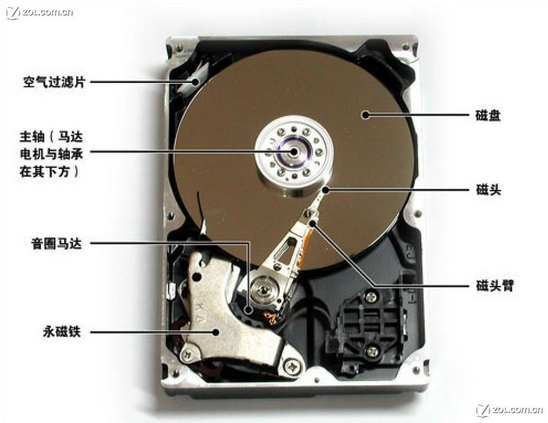

每个硬盘都一个磁头(相当于银行柜台), 硬盘的工作方式是:
1. 收到IO请求. 得到地址和数据大小
2. 移动磁头(寻址)
3. 找到相应的磁道(寻址)
4. 读取数据
5. 传输数据

则磁盘的随机IO的服务时间:

服务时间 = 寻到时间 + 旋转时间 + 传输时间

对于10000转速的SATA硬盘来说,  一般寻到时间是7ms, 旋转时间是3ms, 64kb的传输时间是0.8ms, 则stat硬盘每秒可以进行随机IO操作时1000/(7+3+0.8) = 93, 所以我们估算SATA硬盘64KB随机写IOPS是93. 一般的硬盘厂商表明顺序读写的MBPS.

再列出IOPS时, 需要说明IO大小, 寻址空间, 读写模式, 顺序/随机, 队列深度. 常用IO大小是4KB, 这是因为操作系统常用的4KB.

### 使用dd测试硬盘
先用dd测试一下硬盘的MBPS(吞吐量)
```
#dd if=/dev/zero of=/dev/sdd bs=4k count=300000 oflag=direct
记录了300000+0 的读入 记录了300000+0 的写出 1228800000字节(1.2 GB)已复制，17.958 秒，68.4 MB/秒
```

```
#iostat -x sdd 5 10
...
Device: rrqm/s wrqm/s r/s w/s rsec/s wsec/s avgrq-sz avgqu-sz await svctm %util 
sdd 0.00 0.00 0.00 16794.80 0.00 134358.40 8.00 0.79 0.05 0.05 78.82
...
```
为什么这块硬盘的MBPS只有68MB/S?
因为磁盘利用率78%, 没有达到95%以上, 还有部分时间是空闲的. 当dd在前一个IO响应之后, 在准备发起下一个IO时, SATA硬盘是空闲的. 那么么如何才能提高利用率, 让磁盘不空闲? 只有一个办法, 那就是增加硬盘队列的深度. 相对于CPU来说, 硬盘属于慢速设备,素有操作系统会有给每一个硬盘分配一个专门的队列用于缓冲IO请求.

### 队列深度

什么是队列深度?
> 在某时刻有N个infight的IO请求, 包括在队列中的IO请求, 磁盘正在处理的IO请求, N就是队列深度.

加大硬盘深度就是让硬盘不断工作, 减少硬盘的空闲时间.

> 加大队列深度 -> 提高利用率 --> 获取IOPS和MBPS峰值-->注意响应时间在可接受范围内

增大队列深度的办法?
1. 使用异步IO, 同时发起多个IO请求, 相当于队列有多个IO请求.
2. 多线程发起同步IO请求
3. 增大应用IO大小, 达到底层之后, 会变成多个IO请求,相当于队列中有多个IO请求 队列深度增加了。

队列深度增加了，IO在队列的等待时间也会增加，导致IO响应时间变大，这需要权衡。让我们通过增加IO大小来增加dd的队列深度，看有没有效果：

```
dd if=/dev/zero of=/dev/sdd bs=2M count=1000 oflag=direct 
记录了1000+0 的读入 记录了1000+0 的写出 2097152000字节(2.1 GB)已复制，10.6663 秒，197 MB/秒
```

```
Device: rrqm/s wrqm/s r/s w/s rsec/s wsec/s avgrq-sz avgqu-sz await svctm %util 
sdd 0.00 0.00 0.00 380.60 0.00 389734.40 1024.00 2.39 6.28 2.56 97.42
```

可以看到2MB的IO到达底层之后，会变成多个512KB的IO，平均队列长度为2.39，这个硬盘的利用率是97%，MBPS达到了197MB/s。(为什么会变成512KB的IO，你可以去使用Google去查一下内核参数 max_sectors_kb的意义和使用方法 )

也就是说增加队列深度，是可以测试出硬盘的峰值的。

### 使用fio测试硬盘
现在测试SATA硬盘的4kb随机读写的IOPS.
```bash
$fio -ioengine=libaio -bs=4k -direct=1 -thread -rw=randwrite -size=1000G -filename=/dev/vdb \
-name="EBS 4K randwrite test" -iodepth=64 -runtime=60
```

fio参数:

`ioengine`: 负载引擎, 一般使用libaio, 发起异步IO
`bs`: IO大小
`direct`: 直写, 绕过操作系统的cache.
`rw`: 读写模式, 有顺序写write, 顺序读read, 随机写randwrite, 随机度randread等.
`size`: 寻址空间, io会在落在[0, size]这个区间的硬盘空间上. 这个可以影响IOPS的参数. 一般设置为硬盘的大小.
`filename`: 测试对象
`iodepth`: 队列深度, 只有使用libaio是才有意义. 这个可以影响IOPS的参数
`runtime`: 测试时长

下面我们做两次测试，分别 iodepth = 1和iodepth = 4的情况。下面是iodepth = 1的测试结果。


上面蓝色方框里面的是测出的IOPS 230, 绿色的是每个IO请求的平均响应时间, 大约是4.3ms. 黄色方框表示95%的IO的响应时间是小于等于9.920ms.橙色表示该硬盘的利用率达到98.58%

下面是iodepth = 4的测试:


我们发现这次测试的IOPS没有提高，反而IO平均响应时间变大了，是17ms。

为什么这里提高队列深度没有作用呢，原因当队列深度为1时，硬盘的利用率已经达到了98%，说明硬盘已经没有多少空闲时间可以压榨了。而且响应时间为 4ms。 对于SATA硬盘，当增加队列深度时，并不会增加IOPS，只会增加响应时间。这是因为硬盘只有一个磁头，并行度是1， 所以当IO请求队列变长时，每个IO请求的等待时间都会变长，导致响应时间也变长。

这是以前用IOMeter测试一块SATA硬盘的4K随机写性能，可以看到IOPS不会随着队列深度的增加而增加，反而是平均响应时间在倍增。


### 寻址空间对IOPS的影响

我们继续测试SATA硬盘，前面我们提到寻址空间参数也会对IOPS产生影响，下面我们就测试当size=1GB时的情况。
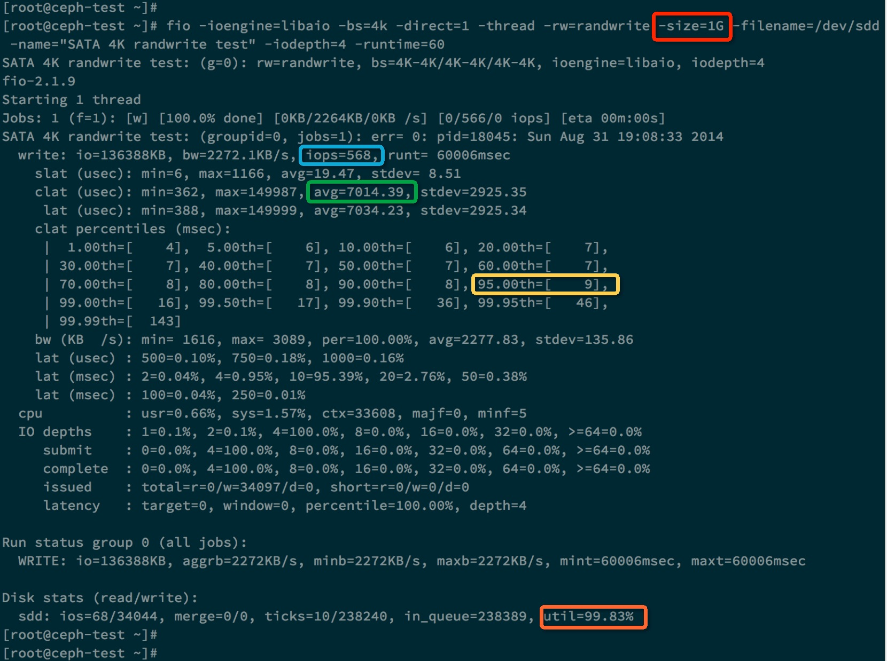

我们发现，当设置size=1GB时，IOPS会显著提高到568，IO平均响应时间会降到7ms(队列深度为4)。这是因为当寻址空间为1GB时，磁头需要移动的距离变小了，每次IO请求的服务时间就降低了，这就是空间局部性原理。假如我们测试的RAID卡或者是磁盘阵列(SAN)，它们可能会用Cache把这1GB的数据全部缓存，极大降低了IO请求的服务时间(内存的写操作比硬盘的写操作快很1000倍)。所以设置寻址空间为1GB的意义不大，因为我们是要测试硬盘的全盘性能，而不是Cache的性能。

### 硬盘优化
硬盘厂商提高硬盘性能的方法主要是降低服务时间(延迟).

- 提高转速(降低旋转时间和传输时间)
- 增加cache(降低写延迟, 但不会提高IOPS)
- 提高单磁道密度(变相提高了传输时间)

## RAID测试

RAID0/RAID5/RAID6的多块磁盘可以同时服务，其实就是提高并行度，这样极大提高了性能(相当于银行有多个柜台)。

以前测试过12块RAID0，100GB的寻址空间，4KB随机写，逐步提高队列深度，IOPS会提高，因为它有12块磁盘(12个磁头同时工作)，并行度是12。

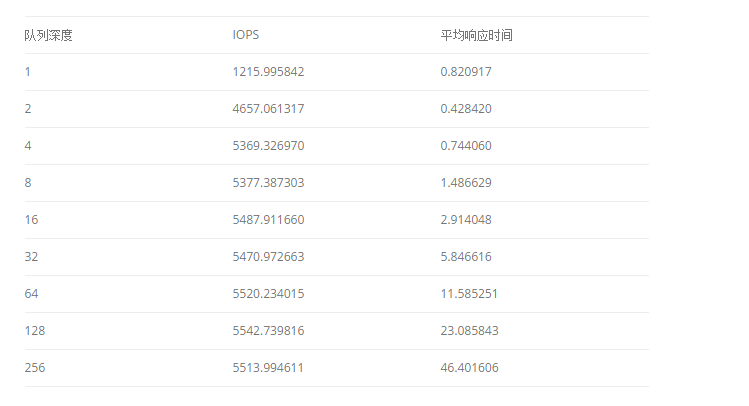

Raid卡厂商优化的方法也是降低服务时间:
- 使用加大内存cache
- 使用IO处理器, 降低XIR操作的延迟
- 使用更大带宽的硬盘接口


## SAN 测试
对于低端磁盘阵列，使用单机IOmeter就可以测试出它的IOPS和MBPS的峰值，但是对于高端磁盘阵列，就需要多机并行测试才能得到IOPS和MBPS的峰值(IOmeter支持多机并行测试)


磁盘阵列厂商通过以下手段降低服务时间：

1. 更快的存储网络，比如FC和IB，延时更低。
2. 读写Cache。写数据到Cache之后就马上返回，不需要落盘。 而且磁盘阵列有更多的控制器和硬盘，大大提高了并行度。

## SSD测试
SSD的延时很低，并行度很高(多个nand块同时工作)，缺点是寿命和GC造成的响应时间不稳定

推荐用IOMeter进行测试，使用大队列深度，并进行长时间测试，这样可以测试出SSD的真实性能。

下图是storagereview对一些SSD硬盘做的4KB随机写的长时间测试，可以看出有些SSD硬盘的最大响应时间很不稳定，会飙高到几百ms，这是不可接受的。


## 云硬盘测试
通过两方面来提高云硬盘的性能:

1. 降低延迟(使用SSD，使用万兆网络，优化代码，减少瓶颈)
2. 提高并行度(数据分片，同时使用整个集群的所有SSD)

### 在Linux下测试云硬盘

在Linux下，你可以使用FIO来测试

操作系统：Ubuntu 14.04
CPU： 2
Memory: 2GB
云硬盘大小： 1TB(SLA: 6000 IOPS, 170MB/s吞吐率 )
安装fio：

`#sudo apt-get install fio`

#### 4K随机写测试

我们首先进行4K随机写测试，测试参数和测试结果如下所示：
```
#fio -ioengine=libaio -bs=4k -direct=1 -thread -rw=randwrite -size=100G -filename=/dev/vdb \
-name="EBS 4KB randwrite test" -iodepth=32 -runtime=60
```

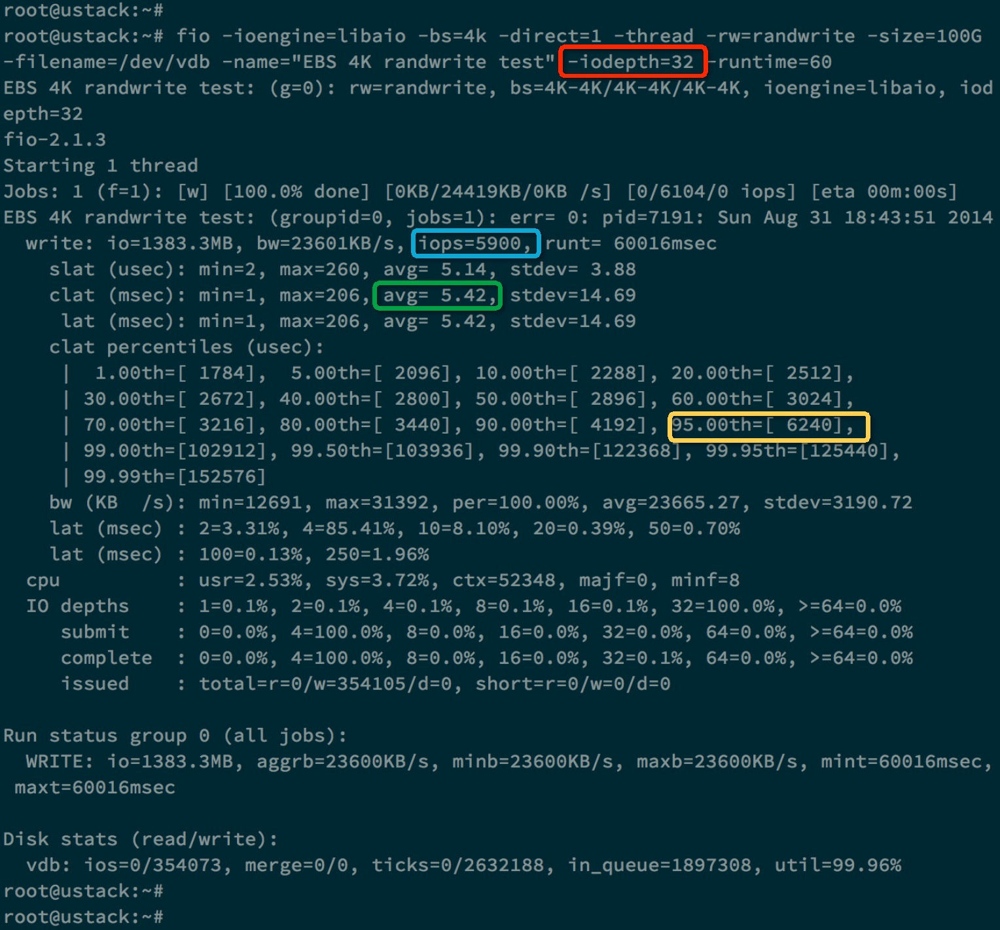

蓝色方框表示IOPS是5900，在正常的误差范围内。绿色方框表示IO请求的平均响应时间为5.42ms， 黄色方框表示95%的IO请求的响应时间是小于等于 6.24 ms的。

#### 4K随机读测试

```
#fio -ioengine=libaio -bs=4k -direct=1 -thread -rw=randread -size=100G -filename=/dev/vdb \
-name="EBS 4KB randread test" -iodepth=8 -runtime=60
```
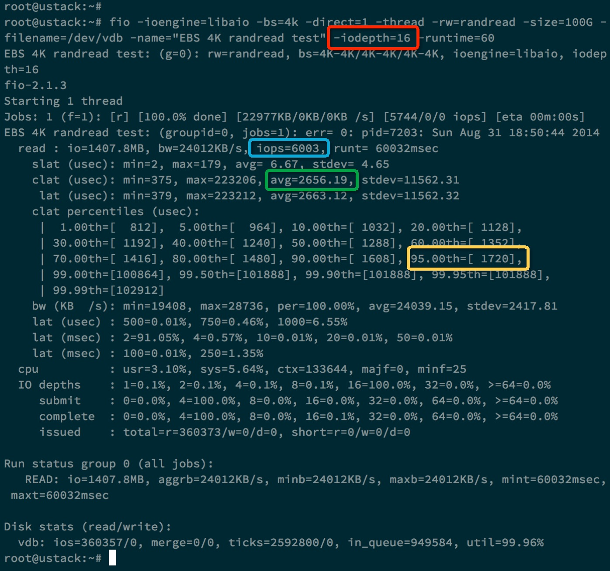


#### 512KB顺序写测试

最后我们来测试512KB顺序写，看看云硬盘的最大MBPS(吞吐率)是多少，测试参数和测试结果如下所示：
```
#fio -ioengine=libaio -bs=512k -direct=1 -thread -rw=write -size=100G -filename=/dev/vdb \
-name="EBS 512KB seqwrite test" -iodepth=64 -runtime=60
```

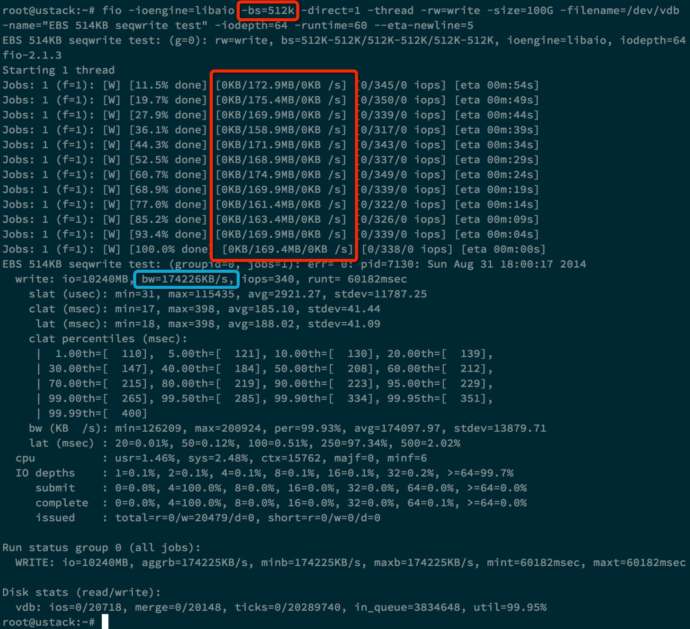

蓝色方框表示MBPS为174226KB/s，约为170MB/s。

#### 使用dd测试吞吐率

其实使用dd命令也可以测试出170MB/s的吞吐率，不过需要设置一下内核参数，详细介绍在 128MB/s VS 170MB/s 章节中。


### 在Windows下测试云硬盘

在Windows下，我们一般使用IOMeter测试磁盘的性能，IOMeter不仅功能强大，而且很专业，是测试磁盘性能的首选工具。
IOMeter是图形化界面(浓浓的MFC框架的味道)，非常方便操作，下面我将使用IOMeter测试我们UOS上1TB的云硬盘。

操作系统：Window Server 2012 R2 64
CPU： 4
Memory: 8GB
云硬盘大小： 1TB

当你把云硬盘挂载到Windows主机之后，你还需要在windows操作系统里面设置硬盘为联机状态。

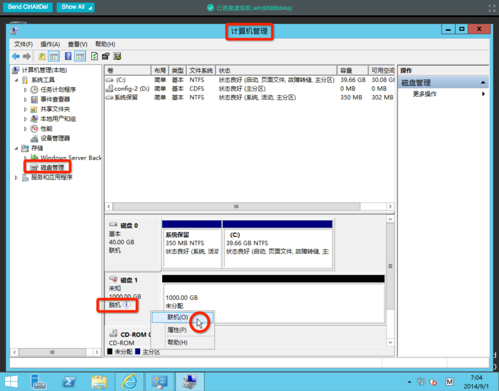

#### 4K随机写测试

打开IOMeter(你需要先下载)，你会看到IOMeter的主界面。在右边，你回发现4个worker(数量和CPU个数相同)，因为我们现在只需要1个worker，所以你需要把其他3个worker移除掉。

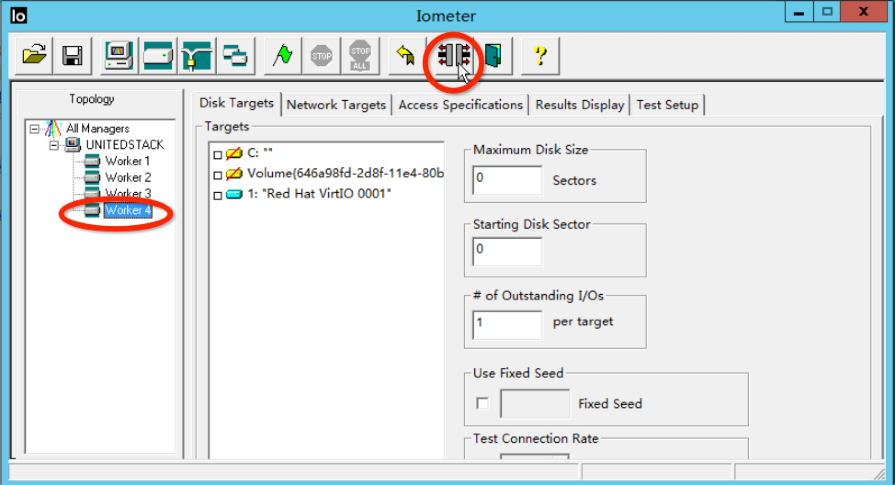

现在让我们来测试硬盘的4K随机写，我们选择好硬盘(Red Hat VirtIO 0001)，设置寻址空间(Maximum Disk Size)为50GB(每个硬盘扇区大小是512B，所以一共是 50*1024*1024*1024/512 = 104857600)，设置队列深度(Outstanding I/Os)为64。


然后在测试集中选择”4KiB ALIGNED; 0% Read; 100% random(4KB对齐，100%随机写操作)” 测试

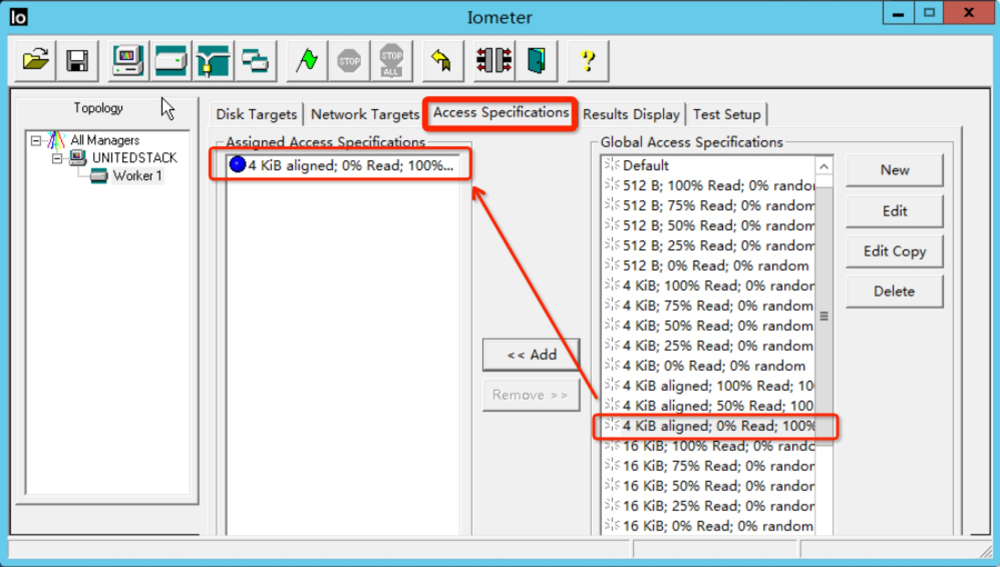

然后设置测试时间，我们设置测试时长为60秒，测试之前的预热时间为10秒(IOMeter会发起负载，但是不统计这段时间的结果)。

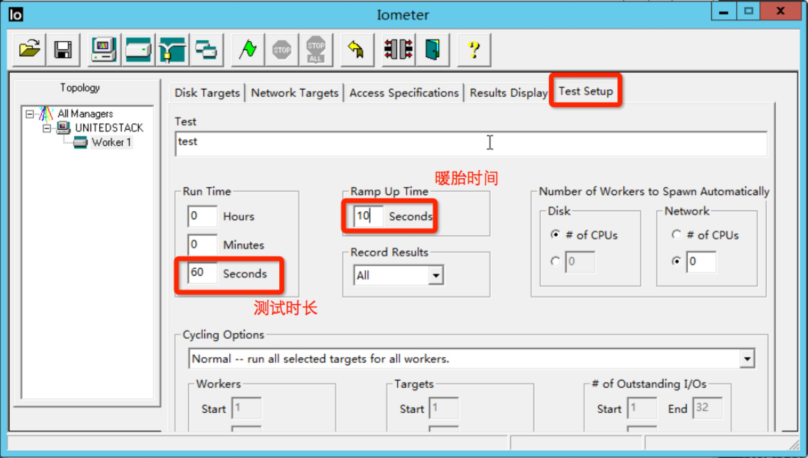

在最后测试之前，你可以设置查看实时结果，设置实时结果的更新频率是5秒钟。最后点击绿色旗子开始测试。

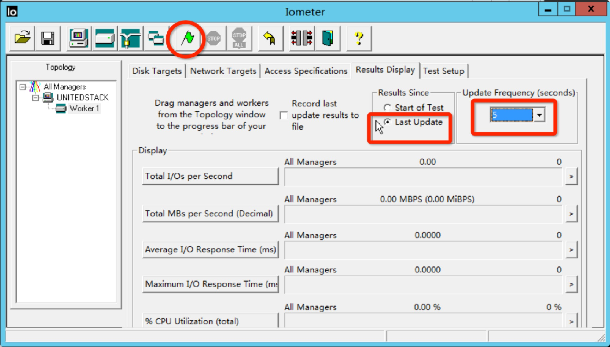

在测试过程中，我们可以看到实时的测试结果，当前的IOPS是6042，平均IO请求响应时间是10.56ms，这个测试还需要跑38秒，这个测试轮回只有这个测试。

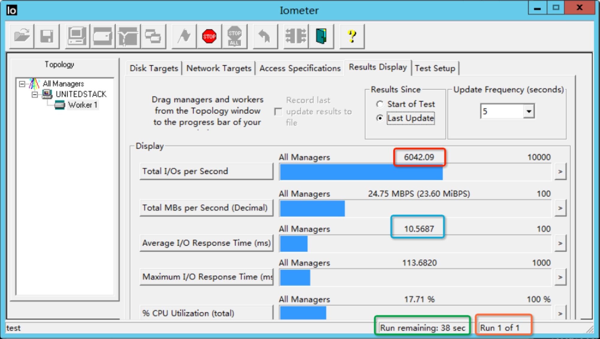

我们可以看到IOMeter自动化程度很高，极大解放测试人员的劳动力，而且可以导出CSV格式的测试结果。

#### 顺序读写测试

我们再按照上面的步骤，进行了顺序读/写测试。下面是测试结果：
                IO大小   读写模式    队列深度    MBPS
顺序写吞吐测试   512KB   顺序写      64  164.07 MB/s
顺序读吞吐测试   256KB   顺序读      64  179.32 MB/s

### 云硬盘的响应时间

当前云硬盘写操作的主要延迟是
1. 网络传输
2. 多副本，写三份(数据强一致性)
3. 三份数据都落盘(数据持久化)之后，才返回
4. IO处理逻辑

我们当前主要是优化IO处理逻辑，并没有去优化2和3，这是因为我们是把用户数据的安全性放在第一位。

### 128MB/s VS 170MB/s

回到最开始的问题 “为什么使用dd命令测试云硬盘只有128MB/s”， 这是因为目前云硬盘在处理超大IO请求时的延迟比SSD高(我们会不断进行优化)，现在我们有两种方法来获得更高的MBPS：

设置`max_sectors_kb为256` (系统默认为512)，降低延迟
使用fio来测试，加大队列深度
通过设置max_sectors_kb这个参数，使用dd也可以测出170MB/s的吞吐量
```
root@ustack:~# cat /sys/block/vdb/queue/max_sectors_kb
512
root@ustack:~# echo "256" > /sys/block/vdb/queue/max_sectors_kb
root@ustack:~#
root@ustack:~# dd if=/dev/zero of=/dev/vdb bs=32M count=40  oflag=direct
40+0 records in
40+0 records out
1342177280 bytes (1.3 GB) copied, 7.51685 s, 179 MB/s
root@ustack:~#
```
同时查看IO请求的延迟：
```
root@ustack:~# iostat -x vdb 5 100
...
Device: rrqm/s wrqm/s r/s w/s rkB/s wkB/s avgrq-sz avgqu-sz await r_await w_await svctm  %util
vdb     0.00  0.00 0.00 688.00 0.00 176128.00  512.00 54.59  93.47 0.00 93.47 1.40  96.56
```
下面是使用fio工具的测试结果，也可以得到170MB/s的吞吐率。


## 不可测试的指标

IOPS和MBPS是用户可以使用工具测试的指标，云硬盘还有一些用户不可测量的指标

1. 数据一致性
2. 数据持久性
3. 数据可用性
4. 
这些指标我们只能通过根据系统架构和约束条件计算得到，然后转告给用户。这些指标衡量着公有云厂商的良心，有机会会专门进行介绍。

## 总结

上面介绍了一下测试工具和一些观点，希望对你有所帮助。

1. 测试需要定性和定量
2. 了解存储模型可以帮助你更好的进行测试
3. 增加队列深度可以有效测试出IOPS和MBPS的峰值
