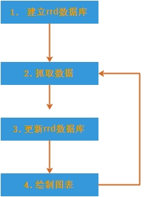
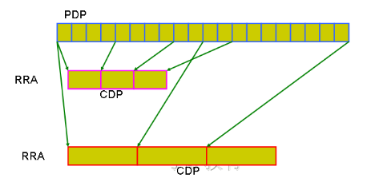

#rrdtools
---

## RRDTool概述
1.概述
RRDtool 代表 “Round Robin Database tool” ，作者同时也是 MRTG 软件的发明人。官方站点位于http://oss.oetiker.ch/rrdtool/ 。 所谓的“Round Robin” 其实是一种存储数据的方式，使用固定大小的空间来存储数据，并有一个指针指向最新的数据的位置。我们可以把用于存储数据的数据库的空间看成一个圆，上面有很多刻度。这些刻度所在的位置就代表用于存储数据的地方。所谓指针，可以认为是从圆心指向这些刻度的一条直线。指针会随着数据的读写自动移动。要注意的是，这个圆没有起点和终点，所以指针可以一直移动，而不用担心到达终点后就无法前进的问题。在一段时间后，当所有的空间都存满了数据，就又从头开始存放。这样整个存储空间的大小就是一个固定的数值。所以RRDtool 就是使用类似的方式来存放数据的工具， RRDtool 所使用的数据库文件的后缀名是'.rrd。如下图，


2.特点
首先 RRDtool 存储数据，扮演了一个后台工具的角色。但同时 RRDtool 又允许创建图表，这使得RRDtool看起来又像是前端工具。其他的数据库只能存储数据，不能创建图表。
RRDtool 的每个 rrd 文件的大小是固定的，而普通的数据库文件的大小是随着时间而增加的。
其他数据库只是被动的接受数据， RRDtool 可以对收到的数据进行计算，例如前后两个数据的变化程度（rate of change），并存储该结果。
RRDtool 要求定时获取数据，其他数据库则没有该要求。如果在一个`时间间隔内`（`heartbeat`）没有收到值，则会用` UNKN` (unknow)代替，其他数据库则不会这样。

## RRDTools绘图的过程


1. 建立rrd文件数据库.
2. 抓取数据. 数据是靠自己定义出来的
3. 将抓出来的数据更新到rrd数据库中
4. 使用rrdtool graph命令,从rrd数据库中读取数据绘出图形.
5. 
```
rrdtool create 
RRDtool 1.3.8  Copyright 1997-2009 by Tobias Oetiker <tobi@oetiker.ch>
               Compiled Apr  3 2014 13:07:03

Usage: rrdtool [options] command command_options

* create - create a new RRD

    rrdtool create filename [--start|-b start time]
        [--step|-s step]
        [DS:ds-name:DST:dst arguments]
        [RRA:CF:cf arguments]
```

`DS`: DS用于定义Data Source. 也就是用于存放结果的变量名.DS用来申明数据源的,也可以理解为申明数据变量,也就是你要 检测的端口对应的变量名, 这个参数在画图的时候还要使用. **数据源**就是一个将要画图的一个数据

`DST`: DST的就是DS的类型.有COUNTER, GUAGE, DERIVE, ABSOLUTE,COMPUTE 5中.由于网卡流量数据计数型,所以应该为COUNTER.  

`RRA`: RRA用于指定数据如何存放.我们可以把RRA看成一张表,各保存不同的interval的统计结果.RRA的作用就是定义于更新的数据是如何记录的. 比如我们每5分钟产生一条数据,那么一个小时就是12条.每天就是288条.这么庞大的数据量,一定不可能都存下来.肯定有一个合并数据的方式,那么这个就是RRA作用.

`PDP`: Primary Data Point. 正常情况下每个interval RRDtool都会收到一个值; RRDTool在收到脚本给来的值后会计算出另一个值(例如平均值),这个值就是PDP; 这个值一般为'xxx/秒'的含义.注意，该值不一定等于RRDtool 收到的那个值。除非是GAUGE ，可以看下面的例子就知道了

`CF` :CF就是 Consolidation Function的缩写.也就是合并(统计)功能.AVERAGE, MAX, MIN, LAST这四种分表表示对多个PDP进行取平均,最大值,最小值,取当前值.

`CDP`: Consolidation Data Point.RRDtool使用多个PDP合并为一个CDP.也就是执行上面的CF操作后的结果.这个表就是存入RRA的数据, 绘图时使用的也是这些数据.

### 下面是RRA与PDP,CDP的关系图



## 参数的含义
(1) `filenanme`: 默认以.rrd为扩展名的结尾

(2) `--start|b starttime`: 设定RRD数据库加入的第一个数值时间, 从1970-01-01 00:00:00 UTC 时间以来的秒数. RRDTool不接受早于或者在这个时刻上的任何数值. 默认是now-10s. 如果update操作给出的时间在--start之前,RRDTool则拒绝接受. --start是可选的. 如果start指定一天前可以`--start $(date -d 1 days ago +%s` time必须是timestamp格式.

(3) `--step| -s step`: 指定数据将要被填入RRD数据库的基本时间间隔. 默认为300;

(4) `DS:ds-name:DST: dst arguements DS(Data Source)`: 
**DS**DS用于定义Data Source. 也就是用于存放结果的变量名. DS是用来申明数据源的, 也可以理解为声明数据变量, 也就是你要检测的数据对应的变量的名, 这个在画图的时候使用.这里开始定义RRD数据的基本属性;单个RRD数据库可以接受来自几个数据源的输入.在DS选项中要为每一个需要在RRD中存储的数据源指定一些基本的属性; ds-name为数据域的名字. DST定义数据源的类型, dst arguments参数依赖于数据源的类型.

`DS:ds-name:GAUGE | COUNTER | DERIVE | ABSOLUTE:heartbeat:min:max`

**案例**：`DS:mysql:COUNTER:600:0:100000000`
`DS`(Data Source，数据源)表达式总共有六个栏位：
- `DS` 表示这个为DS表达式
- `ds-name `数据域命名
- `DST `定义数据源的类型
- `heartbeat` 有效期(heartbeat)，案例里的值为'600'，假设要取12:00的数据，而前后300秒里的值(11:55-12:05)经过平均或是取最大或最小都算是12:00的有效值；
- `min` 允许存放的最小值，此例允许最小为0。
- `max` 允许存放的最大值，最大为100000000。
> 注，如果不想设限制可以再第五个栏位和第六个栏位以 "U:U"表示（U即Unknown）。

> DST 的选择是十分重要的，如果选错了 DST ，即使你的脚本取的数据是对的，放入 RRDtool 后也是错误的，更不用提画出来的图是否有意义了。
> 

**DST的类型**
1. `GAUGE` ：GAGUE 和上面三种不同，它没有“平均”的概念，RRDtool 收到值之后字节存入 RRA 中。

2. `COUNTER` ：必须是递增的，除非是计数器溢出。在这种情况下，RRDtool 会自动修改收到的值。例如网络接口流量、收到的packets 数量都属于这一类型。
DERIVE：和 COUNTER 类似。但可以是递增，也可以递减，或者一会增加一会儿减少。

3. `ABSOLUTE` ：ABSOLUTE 比较特殊，它每次都假定前一个interval的值是0，再计算平均值。

4. `COMPUTE` ：COMPUTE 比较特殊，它并不接受输入，它的定义是一个表达式，能够引用其他DS并自动计算出某个值。例如CODE：DS:eth0_bytes:COUNTER:600:0:U DS:eth0_bits:COMPUTE:eth0_bytes,8,* 则 eth0_bytes 每得到一个值，eth0_bits 会自动计算出它的值：将 eth0_bytes 的值乘以 8 。不过 COMPUTE 型的 DS 有个限制，只能应用它所在的 RRD 的 DS ，不能引用其他 RRD 的 DS。 COMPUTE 型 DS 是新版本的 RRDtool 才有的，你也可以用 CDEF 来实现该功能。如:CDEF:eth0_bits=eth0_bytes,8,*


**实例说明**:

Values = 300, 600, 900, 1200
假设 RRDtool 收到4个值，分别是300，600，900，1200。 
Step = 300 seconds
step 为 300 
COUNTER = 1，1，1，1
（300-0）/300，（600-300）/300，（900-600）/300，（1200-900）/300 ，所以结果为 1，1，1，1 

DERIVE = 1，1，1，1 
ABSOLUTE = 1，2，3，4
(300-0)/300，(600-0)/300，(900-0)/300，(1200-0)/300，所以结果为 1，2，3，4 
GAUGE = 300，600，900，1200  
300 , 600 ,900 ,1200 

不做运算，直接存入数据库。所以第一行的 values 并不是 PDP，后面4行才是PDP。

**实例**

```bash
[root@node1 ~]# rrdtool create eth0.rrd \
> --step 300 \
> DS:eth0_in:COUNTER:600:0:12500000 \
 # 600 是 heartbeat；0 是最小值；12500000 表示最大值；
> DS:eth0_out:COUNER:600:0:12500000 \
# 如果没有最小值/最大值，可以用 U 代替，例如 U:U
> RRA:AVERAGE:0.5:1:600 \
# 1 表示对1个 PDP 取平均。实际上就等于 PDP 的值
> RRA:AVERAGE:0.5:4:600 \
# 4 表示每4个 PDP 合成为一个 CDP，也就是20分钟。方法是对4个PDP取平均，
> RRA:AVERAGE:0.5:24:600 \ # 同上，但改为24个，也就是24*5=120分钟=2小时。
> RRA:AVERAGE:0.5:288:730
 # 同上，但改为288个，也就是 288*5=1440分钟=1天
 
[root@node1 ~]# ll -h eth0.rrd
-rw-r--r--  1 root   root     41K 10月 11 10:16 eth0.rrd
```

(5) `RRA:CF:cf arguments`
RRA的作用就是定义更新的数据是如何记录的。比如我们每5分钟产生一条刷新的数据，那么一个小时就是12条。每天就是288条。这么庞大的数据量，一定不可能都存下来。肯定有一个合并（consolidate）数据的方式，那么这个就是RRA的作用了。如下图

(images/rra_cf.png)
RRD的一个目的是在一个环型数据归档中存储数据。一个归档有大量的数据值或者每个已定义的数据源的统计，而且它是在一个RRA行中被定义的。当一个数据进入RRD数据库时，首先填入到用 `-s` 选项所定义的步长的时隙中的数据，就成为一个pdp值，称为`首要数据点`（Primary Data Point）。该数据也会被用该归档的CF归并函数进行处理。可以把各个PDPs通过某个聚合函数进行归并的归并函数有这样几种：`AVERAGE`、`MIN`、`MAX`、`LAST`等。这些归并函数的RRA命令行格式为:

`RRA:AVERAGE | MIN | MAX | LAST:xff:steps:rows`


**什么是 CF？**
以上面的案例中第2个RRA 和 4，2，1，3 这4个 PDP 为例
`RRA:AVERAGE:0.5:4:600`

- `AVERAGE` ：则结果为 (4+2+1+3)/4=2.5
- `MAX` ：结果为4个数中的最大值 4
- `MIN` ：结果为4个数中的最小值1
- `LAST` ：结果为4个数中的最后一个 3
同理，第三个RRA和第4个RRA则是每24个 PDP、每288个 PDP 合成为1个 CDP。


**解释度（Resolution）**
这里要提到一个 Resolution 的概念，在官方文档中多处提到 resolution 一词。Resolution 究竟是什么？Resolutino 有什么用？举个例子，如果我们要绘制1小时的数据，也就是60分钟，那么我们可以从第一个RRA 中取出12个 CDP 来绘图；也可以从第2个 RRA中取出3个 CDP 来绘图。到底 RRDtool 会使用那个呢？让我们看一下 RRA 的定义 ：`RRA:AVERAGE:0.5:4:600` 。
Resolution 就等于 `4 * step = 4 * 300 = 1200` ，也就是说 ，resolution 是每个CDP 所代表的时间范围，或者说 RRA 中每个 CDP（记录）之间的时间间隔。所以第一个 RRA 的 resolution 是 1* step=300，第2是 1200，第三个是 24*300=7200，第4个 RRA 是 86400 。
默认情况下，RRDtool 会自动挑选合适的 resolution 的那个 RRA 的数据来绘图。我们大可不必关心它。但如果自己想取特定 RRA 的数据，就需要用到它了。关于 Resolution 我们还会在 fetch 和 graph 中提到它。

**xff 字段**
细心的朋友可能会发现，在 RRA 的定义中有一个数值，固定是 `0.5` ，这个到底是什么东东呢？ 
这个称为 xff 字段，是 `xfile factor` 的缩写。让我们来看它的定义 ：
>QUOTE:
The xfiles factor defines what part of a consolidation interval may be made up from *UNKNOWN* data while 
the consolidated value is still regarded as known. It is given as the ratio of allowed *UNKNOWN* PDPs to 
the number of PDPs in the interval. Thus, it ranges from 0 to 1 (exclusive)

这个看起来有点头晕，我们举个简单的例子 ：例如
`CODE:RRA:AVERAGE:0.5:24:600`

这个 RRA 中，每`24个 PDP` （共两小时）就合成为一个` CDP`，如果这 24 个 PDP 中有部分值是 `UNKNOWN` （原因可以很多），例如1个，那么这个 CDP合成的结果是否就为 `UNKNOWN` 呢？

不是的，这要看 `xff 字段而定`。Xff 字段实际就是一个`比例值`。`0.5 表示一个 CDP 中的所有 PDP 如果超过一半的值为 UNKNOWN` ，则该 CDP 的值就被标为UNKNOWN。也就是说，如果24个 PDP中有12个或者超过12个 PDP 的值是 UNKNOWN ，则该 CPD 就无法合成，或者合成的结果为 UNKNOWN；如果是11个 PDP 的值为 UNKNOWN ，则该 CDP 的值等于剩下 13 个 PDP 的平均值。

如果一个 CDP 是有2个 PDP 组成，xff 为 0.5 ，那么只要有一个 PDP 为 UNKNOWN ，则该 PDP 所对应的 CDP 的值就是 UNKNOWN 了。

## 抓取数据
更新RRD数据库数据,使用update
update 语法
```
rrdtool update filename [--template|-t ds-name[:dsname]...] N|timestamp:value[:value...]
```
`filename` RRD数据库文件名称
`--template|-t ds-name[:ds-name]` 要更新RRD数据库中数据源的名称，其中-t指定数据源的顺序
`N|timestamp:value[:value...] `时间:要更新的值

```
[root@node1 ~]#rrdtool update eth0.rrd 1381467942:60723022 或
[root@node1 ~]# rrdtool update eth0.rrd N:60723022
```

其中，1381467942是当前的时间戳，可以用date +%s命令获得，或者直接用N代替。60723022是当前要更新的流量数据，可以用shell脚本获得。下面我们来查看一下，更新的数据。
```
[root@node1 ~]# rrdtool fetch eth0.rrd AVERAGE
```

##　绘制图表
graph 语法

```
rrdtool graph filename [option ...]
    [data definition ...]
    [data calculation ...]
    [variable definition ...]
    [graph element ...]
    [print element ...]
```

其中的 data definiton、variable definition 、data calculation、分别是下面的格式:
```
DEF:<vname>=<rrdfile>:<ds-name>:<CF>[:step=<step>][:start=<time>][:end=<time>][:reduce=<CF>]

VDEF:vname=RPN expression
CDEF:vname=RPN expression

```
其中 filename 就是你想要生成的图片文件的名称，默认是 png 。你可以通过选项修改图片的类型，可以有 PNG、SVG、EPS、PDF四种。

(1) DEF是Definition: 从哪个RRD文件中取得数据
为什么还有一个 CF 字段？因为 RRA 有多种CF 类型，有些 RRA 可能用来保存平均值、有些 RRA 可能用于统计最大值、最小值等等。所以你必须同时指定使用什么 CF 类型的 RRA的数据。
至于 :start 和 :end 、:reduce 则用得比较少，最常用的就是 :step 了，它可以让你控制 RRDtool 从那个 RRA 中取数据。

(2) VDEF是variable Definition, 定义图表的下面的说明信息,最大值,最小值等
这个变量朱门存放某个种类的值, 例如eth0_in的最大值,eht0_out 的当前值等.

同样它也需要用一个变量来存放数值。要注意的是，旧版 的 RRDtool 中是用另外一种格式来达到相同的目的。新版的 RRDtool 则推荐使用VDEF语句。但在使用过程中，却发现 VDEF 的使用反而造成了困扰。 例如你有5个 DS 要画，每个 DS 你都想输出最大值、最小值、平均值 、当前值。 如果使用 VDEF ，则需要 4 * 5 = 20 个 VDEF 
语句，这会造成极大的困扰。具体例子可以看第十一节“数字报表”部分。

(3) CDEF是Calculation define的意思, 。CDEF 支持很多数学运算，甚至还支持简单的逻辑运算 if-then-else ，可以解决前面提到的第2个问题：如何只绘制你所关 心的数据。不过这一切都需要熟悉 RPN 的语法.所以我们放到下一节介绍，这一节就介绍把 RRDtool 中的数据以图表的方式显示出来。

(4).其它选项分类
本部分我们按照官方文档的方式，把选项分成几大类，分为 ：
- Time range ： 用于控制图表的X轴显示的起始/结束时间，也包括从RRA中提取指定时间的数据。
- Labels ：用于控制 X/Y 轴的说明文字。
- Size ：用于控制图片的大小。
- Limits ：用于控制 Y 轴的上下限。
- Grid ：用于控制 X/Y 轴的刻度如何显示。
- Miscellaneous ：其他选项。例如显示中文、水印效果等等。
- Report ：数字报表

> 注，需要说明的是，本博文中并不是列出了所有选项的用法，只是列出较为常用的选项，如果想查看所有选项的的用法，可以到官方站点下载文档。其实大部分选项我们都可以使用默认值不需要修改的。下面是常用选项:

```
rrdtool graph filename [option ...] [data definition ...] [data calculation ...] [variable definition ...] [graph element ...] [print element ...]
```

- filename 要绘制的图片名称
- Time range时间范围
- [-s|--start time] 启始时间[-e|--end time]结束时间 [-S|--step seconds]步长
- Labels
- [-t|--title string]图片的标题 [-v|--vertical-label string] Y轴说明
- Size
- [-w|--width pixels] 显示区的宽度[-h|--height pixels]显示区的高度 [-j|--only-graph]
- Limits
- [-u|--upper-limit value] Y轴正值高度[-l|--lower-limit value]Y轴负值高度 [-r|--rigid]
- Data and variables
- DEF:vname=rrdfile:ds-name:CF[:step=step][:start=time][:end=time]
- CDEF:vname=RPN expression
- VDEF:vname=RPN expression


```
rddtool create eth0.rrd --step 300 \
DS:eth0_in:COUNTER:600:0:1250000 \
DS:eth0_in:COUNTER:600:0:1250000 \
RRA:AVERAGE:0.5:1:600 \
RRA:AVERAGE:0.5:4:600 


rrdtool update eth0.rrd 142000:600324324


```

## 实例

```bash 
yesterday=$(date -d '1 days ago' +"%s" )
rrdtool create yimiapi.rrd --step 300 --start  $yesterday \
DS:add_like:GAUGE:600:0:U \
DS:del_like:GAUGE:600:0:U \
DS:get_home_advertise:GAUGE:600:0:U \
DS:recommand_cites:GAUGE:600:0:U \
DS:get_home_job:GAUGE:600:0:U \
DS:detail_job:GAUGE:600:0:U \
DS:qieye_detail:GAUGE:600:0:U \
DS:add_favjob:GAUGE:600:0:U \
DS:del_favjob:GAUGE:600:0:U \
RRA:AVERAGE:0.5:1:600 \
RRA:AVERAGE:0.5:4:600 \
RRA:AVERAGE:0.5:24:600 \
RRA:AVERAGE:0.5:24:730  \
RRA:MAX:0.5:1:600 \
RRA:MAX:0.5:4:600


```

## Python调用


##　参考

[RRDtool简体中文教程 v1.01](http://bbs.chinaunix.net/forum.php?mod=viewthread&tid=864861&page=1) 

[rrdtool学习笔记](http://blog.liuts.com/post/215/)
[python-rrdtool](https://supportex.net/blog/2011/09/rrd-python/)
[images/rrd001.png]: 
